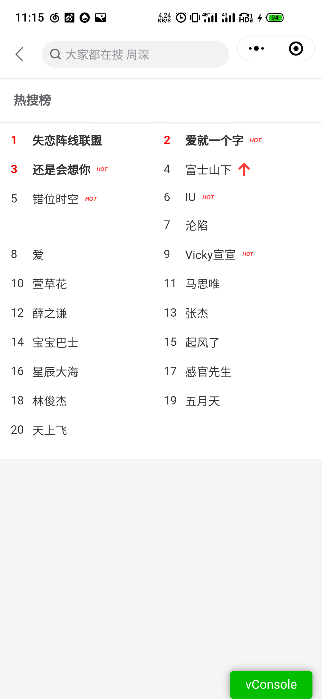
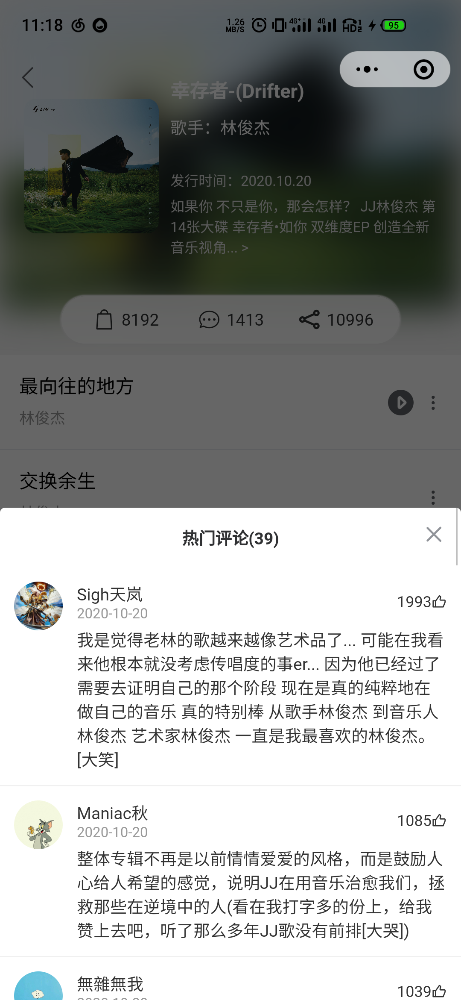
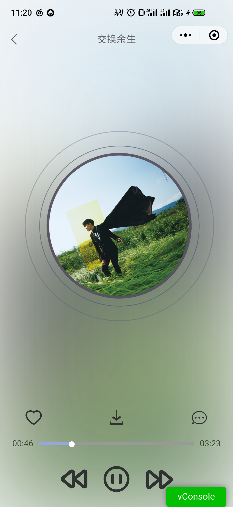
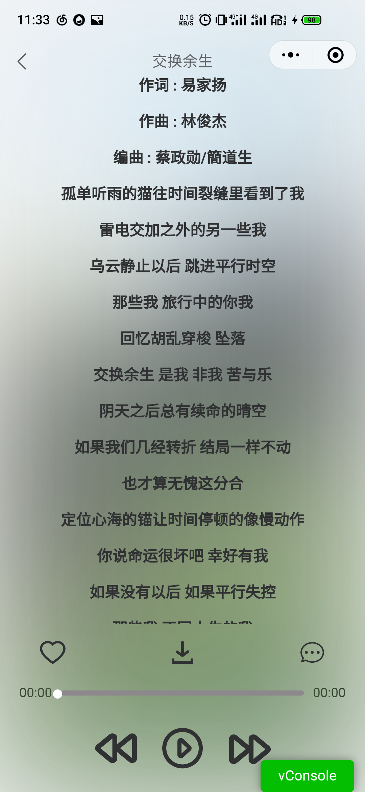
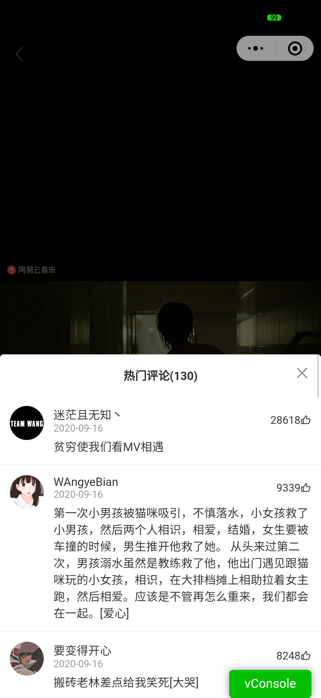

# 【2.0】doItMusic  基于网易云音乐
**uniapp 项目。**
# 参考项目
GitHub网易云音乐接口开源项目
 [Binaryify/NeteaseCloudMusicApi](https://github.com/Binaryify/NeteaseCloudMusicApi)


# 项目介绍
### 1.0的版本中，主要探讨的是视频的上下滑动播放，和nvue原生组件解决视频层级过高问题。
### 当前2.0版本的主要特点如下：
1. 对接口进行进一步的封装，调用接口变得简单；
2. 新增音乐播放界面，配合globalData全局变量，只维护一个audioContext上下文；
3. 使用uniapp提供的动画接口编写动画；
4. 配合vuex状态管理，监听音乐播放的状态数据；
5. 引入音乐播放进度、缓存进度条监听；
6. 解析歌曲的lrc歌词数据，一并展示；
7. 基于沿用视频播放界面上下滑动切换；
8. 引入搜索功能，综合、单曲、歌单、视频等；
9. 解决微信小程序一些样式兼容问题，一些第三方组件、image都需要使用view组件包裹；


# 项目描述
看到了网易云接口的开源项目后，想配合做一个前端页面，顺便熟悉uniapp；这是一个基于uniapp开发的媒体类项目，比较小众，主要功能点是歌曲搜索；音乐、视频播放、规范化开发、以及animation动画的使用等等。因为需求受众较少，只是做学习用，可参考的地方还是有的，后续应该做一些业务需求广的项目。

# 技术点
1. sass - HBuilder X安装sass编译
2. uView - 一套不错的兼容多端的ui框架
3. vuex状态监听
4. 音乐播放，uniapp animation动画
5. lrc歌词解析
6. 视频播放
8. 搜索功能
9. 等等...

# 项目演示

## H5演示地址
pc端查看按F12。[演示地址](http://iszsq.gitee.io/doitmusic)

## 扫码访问


# 项目预览
	这里展示微信小程序端，uniapp是多端兼容的，效果差不多


## 首页
<table >
	<tr>
		<td ></td>
		<td></td>
		<td></td>
	</tr>
</table>

## 搜索
<table >
	<tr>
		<td ></td>
		<td></td>
	</tr>
</table>

<table >
	<tr>
		<td ></td>
		<td></td>
	</tr>
</table>

## 歌手介绍页
<table >
	<tr>
		<td ></td>
	</tr>
</table>

## 专辑/歌单
<table >
	<tr>
		<td ></td>
		<td></td>
	</tr>
</table>

## 音乐播放页
<table >
	<tr>
		<td ></td>
		<td></td>
	</tr>
</table>

## 视频播放页
<table >
	<tr>
		<td ></td>
		<td></td>
	</tr>
</table>


--- 

# 安装运行
参考安装文档：[https://blog.csdn.net/qq_40826978/article/details/114971270](https://blog.csdn.net/qq_40826978/article/details/114971270)
```
git clone https://gitee.com/iszsq/doItMusic.git
cd doItMusic
npm install 
用 HBuilder X 导入项目，在工具内运行和打包
```